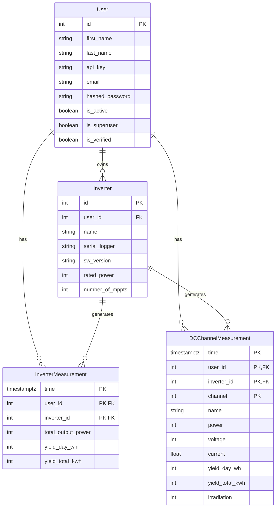

# Database Schema Documentation

This document describes the database schema for the Deye Hard Backend, which uses PostgreSQL with the TimescaleDB extension for efficient time-series data storage.

## Overview

The database consists of:
- **Standard Tables**: For user management and inverter metadata.
- **TimescaleDB Hypertables**: For high-volume time-series measurement data.

## Entity Relationship Diagram

## Standard Tables

### `user`
Stores user account information.

| Column | Type | Constraints | Description |
|--------|------|-------------|-------------|
| `id` | Integer | PK | Unique user identifier |
| `email` | String | Unique, Not Null | User email address |
| `hashed_password` | String | Not Null | Bcrypt hashed password |
| `first_name` | String | Not Null | User's first name |
| `last_name` | String | Not Null | User's last name |
| `api_key` | String | Unique, Nullable | API key for external access |
| `is_active` | Boolean | Not Null | Account status |
| `is_superuser` | Boolean | Not Null | Admin privileges |
| `is_verified` | Boolean | Not Null | Email verification status |

### `inverter`
Stores metadata for solar inverters.

| Column | Type | Constraints | Description |
|--------|------|-------------|-------------|
| `id` | Integer | PK | Unique inverter identifier |
| `user_id` | Integer | FK | Owner of the inverter |
| `name` | String | Not Null | User-friendly name |
| `serial_logger` | String | Unique, Not Null | Physical device serial number |
| `sw_version` | String | Nullable | Software version |
| `rated_power` | Integer | Nullable | Rated power in Watts |
| `number_of_mppts` | Integer | Nullable | Number of MPPT channels |

## TimescaleDB Hypertables

These tables are optimized for time-series data using TimescaleDB.

### `inverter_measurements`
Stores AC-side measurements for the inverter.

**Configuration:**
- **Partitioning**:
  - Time: 7-day chunks
  - Space: `user_id` (4 partitions)
- **Retention Policy**: 730 days (2 years)
- **Compression**: Disabled (due to RLS incompatibility)
- **Row-Level Security**: Enabled (Policy: `user_isolation_policy`)

| Column | Type | Constraints | Description |
|--------|------|-------------|-------------|
| `time` | TIMESTAMPTZ | PK | Measurement timestamp |
| `user_id` | Integer | PK, FK | Owner ID (Partition Key) |
| `inverter_id` | Integer | PK, FK | Inverter ID |
| `total_output_power` | Integer | Not Null | AC Output Power (Watts) |
| `yield_day_wh` | Integer | Nullable | Daily yield (Wh) |
| `yield_total_kwh` | Integer | Nullable | Total lifetime yield (kWh) |

**Indexes:**
- `idx_user_time`: `(user_id, time DESC)`
- `idx_inverter_time`: `(inverter_id, time DESC)`

### `dc_channel_measurements`
Stores DC-side (MPPT) measurements.

**Configuration:**
- **Partitioning**:
  - Time: 7-day chunks
  - Space: `user_id` (4 partitions)
- **Retention Policy**: 730 days (2 years)
- **Compression**: Disabled
- **Row-Level Security**: Enabled (Policy: `dc_channel_user_isolation_policy`)

| Column | Type | Constraints | Description |
|--------|------|-------------|-------------|
| `time` | TIMESTAMPTZ | PK | Measurement timestamp |
| `user_id` | Integer | PK, FK | Owner ID (Partition Key) |
| `inverter_id` | Integer | PK, FK | Inverter ID |
| `channel` | Integer | PK | MPPT Channel Number |
| `name` | String | Not Null | Channel Name (e.g., "PV1") |
| `power` | Integer | Not Null | DC Power (Watts) |
| `voltage` | Integer | Nullable | DC Voltage (Volts) |
| `current` | Float | Nullable | DC Current (Amps) |
| `yield_day_wh` | Integer | Nullable | Daily yield per channel (Wh) |
| `yield_total_kwh` | Integer | Nullable | Total yield per channel (kWh) |
| `irradiation` | Integer | Nullable | Solar irradiation |

**Indexes:**
- `idx_dc_user_time`: `(user_id, time DESC)`
- `idx_dc_inverter_time`: `(inverter_id, time DESC)`
- `idx_dc_channel`: `(inverter_id, channel, time DESC)`

## Multi-Tenancy & Security

Data isolation is enforced at the database level using PostgreSQL Row-Level Security (RLS).

- **Mechanism**: Each query must set the `app.current_user_id` configuration parameter.
- **Policies**:
  - `user_isolation_policy`: Restricts access to `inverter_measurements` rows where `user_id` matches the session variable.
  - `dc_channel_user_isolation_policy`: Restricts access to `dc_channel_measurements` rows where `user_id` matches the session variable.
- **Cascading Deletes**: Deleting a `User` automatically deletes their `Inverter`s, which in turn deletes all associated `InverterMeasurement`s and `DCChannelMeasurement`s.
